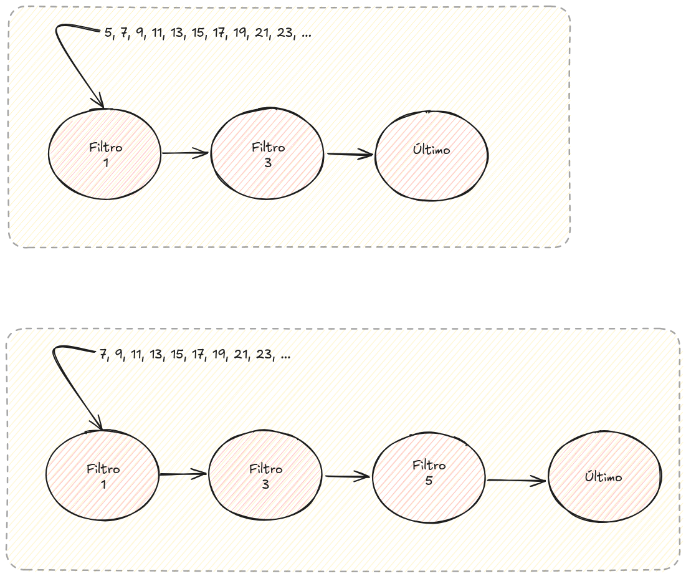

# Criba de Eratóstenes

En este ejercicio implementaremos nuestra versión de la [Criba de
Eratóstenes](https://es.wikipedia.org/wiki/Criba_de_Erat%C3%B3stenes).

La descripción informal de nuestra versión es la siguiente: en lugar
de marcar los números primos, mantemos una coleción de los primos
descubiertos hasta un momento dado. Recorremos cada número natural
desde el 1 en adelante y para determinar si es primo lo filltramos con
los primos conocidos.


Tenemos que implementar nuestra criba en un módulo `Eratostenes` con
una función pública `primos(integer()) :: list(integer())`


```elixir
defmodule Eratostenes do

  def primos(n) do
  end
  
end
```


## Versión secuencial

Nuestra versión secuencial no hace uso de procesos.


## Versión concurrente

Crearemos un proceso por cada número primo que descubrimos, de tal forma que:

  - El proceso filtra todos los números que recibe.
  
  - El proceso tiene un enlace a su _siguiente_ proceso. Excepto el último.
  
  - Si un número pasa el filtro se envía al siguiente proceso.
  
  
_TIP_: La implementación es más sencilla si existe un tipo especial de
proceso que simplemente marca el final de la cadena. A continuación se
muestra un ejemplo de esta idea:

_TIP_: En el rango (2, n) no es necesario incluir los números pares.

Los números del rango (2,n) se envían de uno en uno al primer filtro de la
cadena. Una vez terminados, se envía un mensaje especial para recuperar la
lista de primos.



