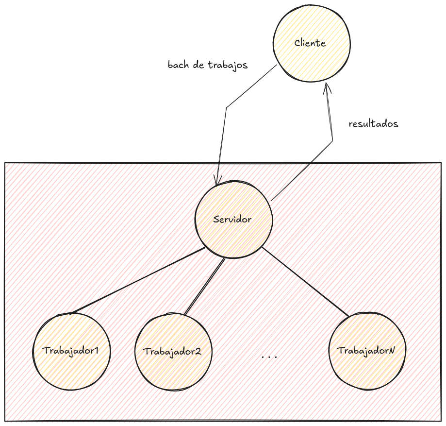

# Pool de trabajadores

En este ejercicio implementaremos una aplicación con un _pool de
trabajadores_.

La aplicación funcionará como un servidor con un servicio principal,
_run batch_, que recibe una lista de trabajos, ejecuta los trabajos y
devuelve uns lista con los resultados de cada trabajo.

La naturaleza de los trabajos no es relevante para este ejercicio, lo
importante es la gestión de la ejecución de los mismos.


## Descripción

El patrón cliente/servidor es muy habitual en la programación con
procesos de _elixir_. Un proceso juega el papel de servidor, recibe
mensajes y envía de vuelta mensajes con el resultado. Por otro lado
los procesos cliente envían mensajes al proceso servidor y esperan la
respuesta.

En este ejercicio, un proceso servidor constituye la parte pública de
la aplicación. Una vez arrancado el servidor, los clientes podrán
solicitar el servicio _run batch_ hasta que se detenga el servidor.

Cuando se usa este modelo, es habitual ofrecer a los clientes un
conjunto de funciones públicas que implementan el intercambio de
mensajes con el servidor. De esta manera evitamos que los clientes
implementen una y otra vez este código y evitamos que los clientes
dependan de la estructura concreta de los mensajes.

En concreto, vamos a implementar tres funciones públicas en un módulo
`Servidor`:

```elixir
defmodule Servidor

  @spec start(integer()) :: {:ok, pid()}
  def start(n) do
  end
  
  @spec run_batch(pid(), list()) :: list()
  def run_batch(master, jobs) do
  end
  
  @spec stop(pid()) :: :ok
  def stop(master) do
  end
end
```

Las funciones `start` y `stop` arrancar y paran, respectivamente, el
proceso servidor.

La función `run_batch` manda al servidor una lista de trabajos. El
servidor ejecuta los trabajos y devuelve una lista con los resultados
de cada trabajo.

Los trabajos se representan como una función sin argumentos. Ejecutar
el trabajo significa evaluar esa función.


## El pool de trabajadores

El servidor nunca ejecuta directamente los trabajos. Para gestionar la
ejecución de los trabajos, el servidor delega en un _pool de
trabajadores_.

El pool de trabajadores es un conjunto de _trabajadores_ con las
siguientes características:

  - El número _trabajadores_ es arbitrario.

  - Un _trabajador_ es un proceso de elixir.
  
  - Todos los trabajadores realizan el mismo trabajo. En este
    ejercicio el trabajo consiste en evaluar una función.
	
  - Un _trabajador_ no puede realizar más de un trabajo a la vez.
  
  - Cuando un _trabajador_ esta realizando un trabajo, no puede
    aceptar otros mensajes.
  
A partir de ahora, vamos a referirnos al servidor como _master_.

Como hemos dicho, el _master_ no ejecuta directamente los trabajos. En
lugar de eso, envía cada trabajo a un trabajador distinto y espera que
los trabajadores le envien los resultados.

El _pool de trabajadores_ se crea en el momento en que arranca el
_master_ y se libera al parar el _master_. El responsable de crear los
trabajadores es el propio proceso _master_.

El número de trabajadores se establece en el momento de iniciar el
_master_. En este ejercicio no consideramos la opción de un _pool de
trabajadores dinámico_.





## La gestión del pool

Cuando el _master_ recibe un _lote_ o _batch_ de trabajos, tiene
múltiples opciones para coordinar su ejecución en el pool. En todos
los casos hay que tener un cuenta:

  - Sólo se pueden usar los trabajadores que están ociosos, i.e. no
    están realizando ningún trabajo.
	
  - Tiene que recopilar las respuestas de los trabajadores.
  
  - Las respuestas de los trabajadores pueden llegar un cualquier
    orden.
	
  - Cuando recibe la respuesta de un trabajador, esto significa que el
    trabajador termino el trabajo y, por tanto, está ocioso.
	
  - Cuando ha recopilado todas las respuestas de un lote, tiene que 
    enviar el resultado al cliente.

  - Puede recibir un lote antes de terminar de procesar un lote
    anterior.
	  
  - El número de trabajos de un lote puede ser mayor o menor que el
    número de trabajadores ociosos y puede ser mayor o menor que el
    número total de trabajadores en el pool.

La gestión del pool de trabajadores puede tener distintas
características que debemos elegir. Algunas son más complejas de
desarrollar que otras.

  - El cliente recibe los resultados de cada trabajo en el mismo
    orden que en el lote de trabajos que envió.
	
  - No se aceptan lotes más grandes que el tamaño del pool.
  
  - Sí se aceptan lotes más grandes que el tamaño del pool.
  
  - Los lotes se quedan es espera hasta que se terminen los lotes
    anteriores.
	
  - Los lotes se ejecutan simultáneamente con otros lotes que ya
    se estén ejecutando.
	
## Requisitos

Seleccione las características del sistema, teniendo en cuenta la
complejidad que conlleva cada una.

Implemente el sistema en dos módulos: `Trabajador` y `Servidor`. El
primero proporciona la implementación de los trabajadores y el segundo
del proceso coordinador y el api externo para los clientes.


## Módulo `Trabajador`

Implementa el proceso `Trabajador`, que recibe los siguientes
mensajes:


  - `{:trabajo, from, func}`, ejecuta la función `func` y devuelve a
    `from` el resultado. Si es necesario para la implementación,
    podemos añadir elementos a la tupla del mensaje.
	
  - `:stop`, termina el proceso.
  
  
## Módulo `Servidor`

Implementa el proceso `Servidor`, a.k.a. _master_, que recibe los
siguientes mensajes:

  - `{:trabajos, from, trabajos}`, donde `trabajos` es una lista de
    funciones (trabajos).
	
  - `{:stop, from}`, para el servidor. Antes debe parar todos los
    trabajadores. Devuelve `:ok` a `from` y termina.

Al inicio, el proceso `Servidor` debe crear `n` trabajadores. Siendo
`n` un parámetro de la función que arranca el servidor.


Si no se aceptan lotes más grandes que el pool de trabajadores, y se
recibe un lote demasiado grande, el servidor devuelve un error
`{:error, :lote_demasiado_grande}`.

Si un lote de trabajos queda en espera hasta que terminen los
anteriores, el servidor no manda ningún mensaje al cliente para
indicar esta situación.
	

## API para los clientes

Evite que los clientes del sistema tengan que conocer los detalles
internos del módulo `Servidor`. Para ello el módulo debe ofrecer las
siguientes funciones públicas:

```elixir
defmodule Servidor

  @spec start(integer()) :: {:ok, pid()}
  def start(n) do
  end
  
  @spec run_batch(pid(), list()) :: list()
  def run_batch(master, jobs) do
  end
  
  @spec stop(pid()) :: :ok
  def stop(master) do
  end
end
```
