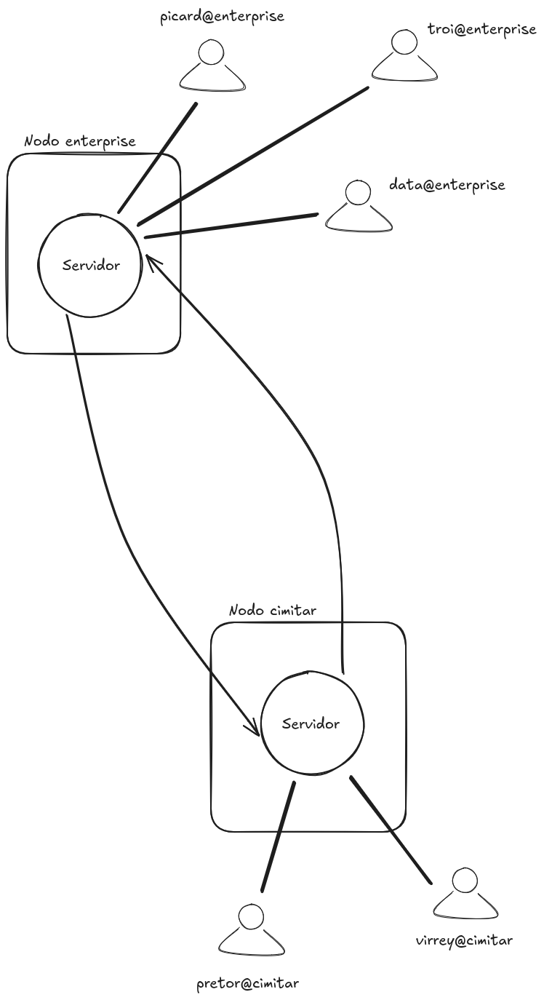

# Servidores federados

En este ejercicio vamos a desarrollar una arquitectura inspirada en la
idea de [servidores
federados](https://es.wikipedia.org/wiki/Fediverso) y uno de los
protocolos más extendidos para la implementación de este tipo de
arquitectura es
[_ActivityPub_](https://es.wikipedia.org/wiki/ActivityPub).

Para el ejercicio emplearemos únicamente los mecanismos propios de
elixir/OTP, desarrollando una versión simplificada de la arquitectura
y el protocolo subyacente.

La idea de partida es que tenemos un conjunto arbitario de _servidores
federados_. Todos los servidores son iguales en características y
servicios ofrecidos. Las personas usuarias del sistema están
registradas únicamente en un _servidor federado_ y únicamente realizan
peticiones a ese servidor.

Sin embargo, una persona usuaria puede realizar una petición que
implice la intervención de un _servidor federado_ distinto. En este
caso el servidor delega la petición al otro _servidor federado_,
recibe la respuesta y se la reenvía a la usuaria.

El siguiente dibujo ilustra la idea de arquitectura del sistema:




El sistema de servidores federados tiene los siguientes servicios:

  - Enviar un mensaje a otra/o usuaria/o.
  
  - Recuperar sus mensajes.
  
  - Consultar el perfil de otra/o usuaria/o.


## Términos y conceptos

- _Usuario_

  Persona usuaria del sistema.

- _Cliente_

  Aplicación que emplea la/el usuaria/o. Le permite acceder a las
  funcionalidades del sistema a través de distintas peticiones a un
  servidor.
  
- _Servidor_

  Cada uno de lo nodos que conforman la red de _servidores
  federados_. Los servidores son independientes, pero pueden
  comunicarse y colborar con otros servidores si es necesario.

- _Actor_

  Un _actor_ representa una cuenta de usuario en un servidor. Una
  persona puede registrarse múltiples actores en distintos servidores,


## Actor

Cada actor tiene un identificador único en todo el sistema se
servidores federados. El identificador tiene el siguiente formato:

> `user@server`

Donde:

  - `server` es el _nombre federado_ del servidor donde está registrada
    la cuenta de usuario.
	
	El nombre federado es un nombre único. No puede haber dos
    servidores federados con el mismo nombre.
	
  - `user` es un nombre de usuario único dentro del servidor.

Cada actor tiene asociados un perfil y un _inbox_. El perfil contiene
la siguiente información del actor:

  - Identificador. P.e.: `spock@enterprise`.
  
  - Nombre completo. P.e.: "S'chn T'gai Spock"
  
  - Avatar. La url de la imagen que se usa como avatar.


El _inbox_ almacena los mensajes que recibe el actor. Es análogo a los
_mailbox_ de los procesos de elixir.


### Servidor

Los servidores tienen dos cometidos principales:

  - Atender las peticiones de los clientes.
	
	P.e.: una usuaria realiza una petición para consultar el perfil de
    un actor.
	
	
  - Colaborar con otros servidores federados.
  
    Como un cliente, realizando peticiones a otros servidores
    federados, o como servidor, atendiendos las peticiones de otros
    servidores federados.
	
  - Como un servidor federado, atendiendo las peticiones de otros
    servidores.

El módulo del servidor debe las siguientes funciones públicas a los
clientes:

```
get_profile(requestor, actor)
    -- requestor es el actor que realiza la petición
    -- actor     identifica el perfil que se desea consultar
							  
post_message(sender, receiver, message)
    -- sender   es el actor que envía el mensaje
    -- receiver es el actor destinatario el mensaje
    -- message  es el mensaje enviado
										 
retrieve_messages(actor)
    -- actor es el actor que realiza la petición
```

## Funcionamiento no federado

Las usuarias únicamente pueden realizar peticiones al servidor en el
que están registradas.

Si el servicio solicitado en recuperar sus mensajes, el servidor
resuelve la petición como un servidor convencional.

Si el servicio solicitado es enviar un mensaje a, o consultar de
perfil de otro actor. Si el actor está registrado en el mismo
servidor, de nuevo resuelve la petición como un servidor convencional.


## Funcionamiento federado

Cuando el servicio solicitado es enviar un mensaje a, o consultar el
perfil de un actor que esta registrado en otro servidor federado, no
se puede resolver la petición de forma convencional. En este caso, la
petición se tiene que delegar en el servidor donde esté registrado el
actor.

La lógica que sigue el servidores para resolver una petición es la
siguiente:

```
si
  la usuaria no es un actor registrado en el servidor 
    error
  
  recuperar mensajes
    responder con _inbox_
	
  enviar a, ver perfil de actor, actor está registrado en el servidor
    resolver la petición
	responder a la usuaria
	
  sino
     enviar la petición al servidor correspondiente
	 espear la respuesta del otro servidor
	 responder a la usuaria
```


Para la comunicación entre _servidores federados_ emplearemos los siguientes
servicios:

```
get_profile(from_server, actor)
    -- from_server es el servidor que redirige la petición
    -- actor       identifica el perfil que se desa consultar
								 
post_message(from_server, receiver, message)
    -- from_server es el servidor que redirige la petición
    -- receiver es el actor destinatario del mensaje
    -- message  es el mensaje enviado
```


## Requisitos

- Emplear `gen_server` para implementar los procesos servidores.

- Usar un _nodo_ por cada _servidor federado_. Es decir, en cada
  _nodo_ de la máquina virtual BEAM sólo puede ejecutarse un único
  servidor.
  
  El nombre federado del servidor es el mismo que el nombre del nodo.

- No se especifica nada sobre el proceso servidor. Cada _servidor
  federado_ está implementado como un proceso _gen_server_, pero a
  priori no sabemos ni su _pid_, ni su nombre de proceso si es que lo
  tiene.
  
  Queda a discrección del equipo de desarrollo resolver este aspecto
  técnico.

- Tenemos que comprobar que las peticiones provienen de un _actor_
  registrado en el servidor, pero no implementaremos ninguna
  autenticación, gestión de permisos, ...

- No consideramos la persistencia de los datos. Podemos asumir que los
  datos se pierden al apagar el sistema.

- El registro y mantenimiento de usuarios no está contemplado en este
  ejercicio.
  
- Es impotante implementar funciones que pueblen los servidores con
  datos de usuarios registrados para realizar pruebas.
